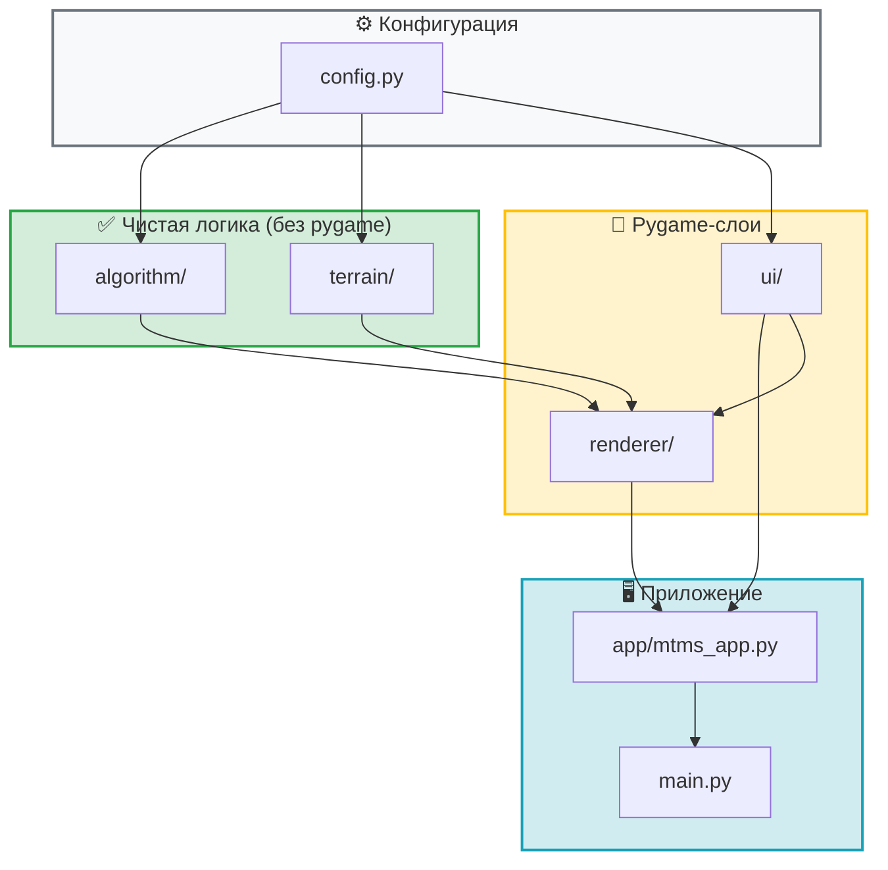
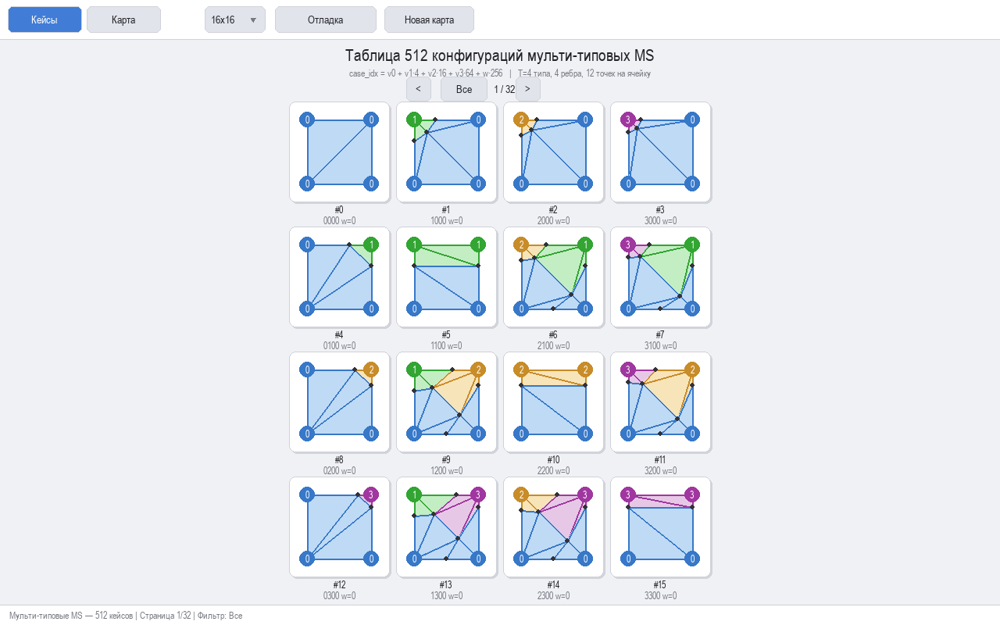
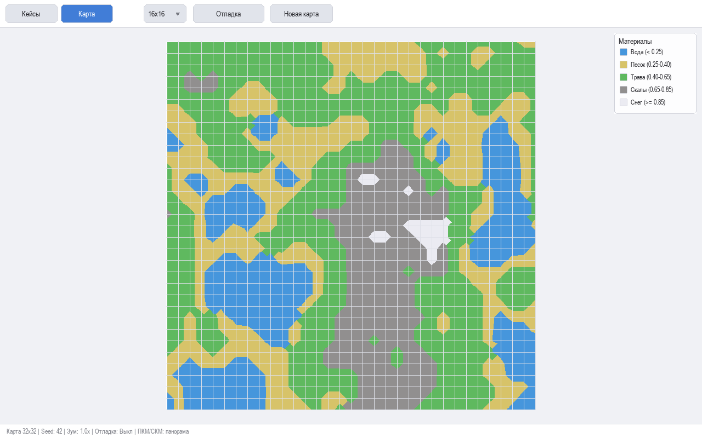
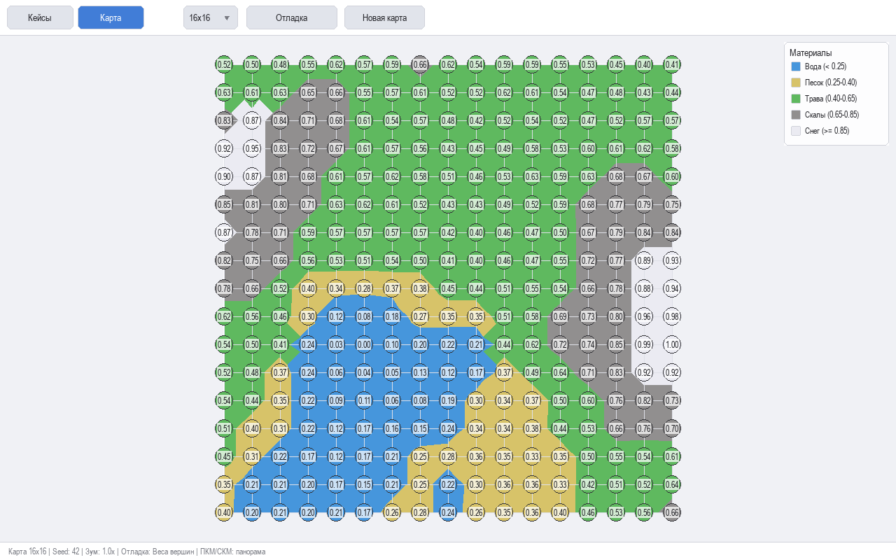

# Multi-Type Marching Squares

Исследование и визуализация адаптированного алгоритма **Marching Squares**, где каждая вершина квадрата может принимать **четыре состояния** (T=4). Диагональные неоднозначности разрешаются через w-флаг на основе весов вершин.

На основе статьи:
> **"Математическая модель и алгоритм много-типовых марширующих квадратов"**
> Н. С. Васильев, Н. Н. Иванова

## Оглавление

* [Описание](#описание)
* [Архитектура](#архитектура)
* [Теория](#теория)
  * [Алгоритм Marching Squares](#алгоритм-marching-squares)
  * [Мульти-типовая версия](#мульти-типовая-версия)
* [Установка и запуск](#установка-и-запуск)
* [Структура проекта](#структура-проекта)
* [Примеры использования](#примеры-использования)
* [Тестирование](#тестирование)
* [Управление](#управление)
* [Скриншоты](#скриншоты)
* [Лицензия](#лицензия)

## Описание

Этот проект реализует интерактивную визуализацию мульти-типового алгоритма Marching Squares:

* **Таблица 512 кейсов**: T=4 типа, 4^4 комбинаций × 2 (флаг w для разрешения диагональной неоднозначности).
* **Нормализация идентификаторов** материалов через последовательную модульную арифметику.
* **12 точек интерполяции** на ячейку (4 вершины + 4 ребра + 4 диагонали).
* **Визуализация кейсов**: постранично по 16 (4×4) с навигацией и фильтром по w-флагу.
* **Генерация карты**: Perlin noise, 5 материалов (Вода/Песок/Трава/Скалы/Снег).
* **Отладка**: веса вершин и номера материалов.
* **Зум** (колесо мыши) и **панорамирование** (ПКМ/СКМ).
* Светлая тема интерфейса.

## Архитектура

Проект декомпозирован в модульный пакет `mtms/` со строго разграниченными слоями:



### Ключевые свойства архитектуры

| Слой | Зависимости | Тестируемо без дисплея? |
|---|---|---|
| `algorithm/` | только stdlib + numpy | ✅ Да — чистая математика |
| `terrain/` | numpy | ✅ Да — генерация данных |
| `ui/` | pygame | ❌ Требует pygame |
| `renderer/` | algorithm, terrain, ui, pygame | ❌ Требует pygame |
| `app/` | все слои | ❌ Требует pygame |

Алгоритмическое ядро (`algorithm/`) и генерация террейна (`terrain/`) **полностью изолированы** от Pygame — их можно тестировать на CI-серверах без дисплея.

## Теория

### Нумерация вершин и рёбер

Нумерация вершин квадрата выполняется по часовой стрелке, начиная с верхнего левого угла:

```
 0──1
 │  │
 3──2
```

Нумерация рёбер соответствует следующим индексам:

* **Ребро 0**: между вершинами 0 и 1 (верхнее)
* **Ребро 1**: между вершинами 1 и 2 (правое)
* **Ребро 2**: между вершинами 2 и 3 (нижнее)
* **Ребро 3**: между вершинами 3 и 0 (левое)

#### Формирование индекса (case)

Индекс `case` для lookup table вычисляется по формуле:

```python
case = sum(vals[i] * (T**i) for i in range(4)) + w * T**4
     = v0 + 4*v1 + 16*v2 + 64*v3 + 256*w
```

где `vals[i]` — состояние (тип) вершины с номером `i`, а `T` — общее число типов (в нашем случае 4). Это позволяет однозначно закодировать комбинацию из четырёх вершин плюс w-флаг в число в диапазоне 0…511.

### 12 точек интерполяции

Каждая ячейка имеет 12 точек для триангуляции:

| Индексы | Назначение |
|---|---|
| 0–3 | Угловые вершины (v0=v_tl, v1=v_tr, v2=v_br, v3=v_bl) |
| 4–7 | Точки пересечения контуров с рёбрами (top, right, bottom, left) |
| 8–11 | Диагональные интерполяционные точки (вершина → центр ячейки) |

### W-флаг — разрешение диагональной неоднозначности

При смешении нескольких типов может возникнуть неоднозначность: по часовой или против часовой стрелке? Флаг w решает это на основе весов вершин:

```
w = round(w_ac / (w_ac + w_bd))
где  w_ac = wa + wc,   w_bd = wb + wd
```

### Алгоритм Marching Squares

Алгоритм Marching Squares — метод для аппроксимации изолиний на прямоугольной сетке. Для каждого квадрата вычисляется «case» на основании значений вершин (обычно бинарных), после чего из lookup table извлекаются сегменты или треугольники для отрисовки контура.

### Мульти-типовая версия

В классической версии состояния вершин — это либо `inside`, либо `outside`. Здесь каждая вершина может иметь T разных типов (0…T-1). Для каждой комбинации из 4 вершин (T^4 кейсов) строятся треугольники:

* Если все вершины одного типа — два треугольника, покрывающих весь квадрат.
* Если сегментов (границ между типами) 2 или 3 — упорядоченный полигон и его веерная триангуляция.
* Если сегментов больше — триангуляция с центром.

## Установка и запуск

> **Требование:** Python **3.12** _(на 3.14 pygame не компилируется на Windows)_.

1. **Клонирование репозитория**

   ```bash
   git clone <URL репозитория>
   cd Multi-type-Marching-Squares
   ```

2. **Создание и активация виртуального окружения**

   ```bash
   python -m venv venv
   source venv/bin/activate    # Linux/macOS
   venv\Scripts\activate       # Windows
   ```

3. **Установка зависимостей**

   ```bash
   pip install -r requirements.txt
   ```

4. **Запуск**

   ```bash
   python main.py              # новая модульная версия
   python marching_squares_viewer_2.0.py  # оригинальный файл (тоже работает)
   ```

## Структура проекта

```
Multi-type-Marching-Squares/
│
├── main.py                              # Точка входа в приложение
├── marching_squares_viewer_2.0.py       # Оригинальная монолитная версия (сохранена)
├── requirements.txt                     # Зависимости
├── LICENSE                              # MIT лицензия
├── screenshots/                         # Примеры скриншотов
│
└── mtms/                                # Модульный пакет
    ├── config.py                        # Централизованная конфигурация (dataclasses)
    │
    ├── algorithm/                       # ЧИСТАЯ логика — без pygame, тестируема
    │   ├── types.py                     # Typed aliases: Triangle, Block, MTMSCase...
    │   ├── table.py                     # build_mtms_table() → 512 кейсов
    │   ├── normalization.py             # normalize_materials(global_ids)
    │   ├── case_index.py                # compute/decode_case_index, compute_w_flag
    │   └── interpolation.py             # compute_12_points(), lerp2d(), edge_interp()
    │
    ├── terrain/                         # numpy-only — без pygame, тестируема
    │   ├── perlin.py                    # perlin_noise_2d (vectorized)
    │   ├── heightmap.py                 # generate_heightmap(), classify_height()
    │   └── materials.py                 # MaterialType(IntEnum), MaterialPalette
    │
    ├── ui/                              # Pygame-компоненты
    │   ├── widgets.py                   # Button, Dropdown (с injected темой)
    │   └── fonts.py                     # load_fonts() с fallback-цепочкой
    │
    ├── renderer/                        # Рендеринг — связка логики и Pygame
    │   ├── cases_view.py                # CasesViewRenderer (сетка 4×4 кейсов)
    │   ├── map_view.py                  # MapViewRenderer (mesh, debug overlay, legend)
    │   └── toolbar.py                   # ToolbarRenderer (toolbar + status bar)
    │
    ├── app/                             # Оркестратор — тонкий слой
    │   ├── mtms_app.py                  # MTMSApp (~250 строк: event loop + state)
    │   └── camera.py                    # Camera(dataclass): pan/zoom state
    │
    └── tests/                           # Unit-тесты ядра (без pygame)
        ├── test_table.py                # 512 кейса, spot-check known cases
        ├── test_normalization.py        # edge cases, identical inputs
        ├── test_case_index.py           # encode/decode roundtrip all 512
        ├── test_interpolation.py        # points in unit square, edge on edges
        └── test_terrain.py              # heightmap determinism, classification
```

## Примеры использования

### Построение таблицы

```python
from mtms.algorithm import build_mtms_table

TABLE = build_mtms_table()
print(len(TABLE))  # 512 кейсов (T=4, w∈{0,1})
```

### Нормализация материалов

```python
from mtms.algorithm import normalize_materials

loc = normalize_materials([3, 1, 4, 0])  # глобальные ID → локальные 0..3
print(loc)  # [1, 0, 2, 0] (примерно)
```

### Интерполяция на ребре

```python
from mtms.algorithm import edge_interp

p1 = (0.0, 0.0)
p2 = (100.0, 0.0)
print(edge_interp(p1, p2, 0.7, 0.3))  # → ~ (75.0, 0.0)
```

### Вычисление case-индекса

```python
from mtms.algorithm import compute_case_index, decode_case_index

ci = compute_case_index((1, 2, 0, 3), w_flag=1)
vals, w = decode_case_index(ci)
print(vals, w)  # (1, 2, 0, 3) 1
```

### Генерация карты высот

```python
from mtms.terrain import generate_heightmap, classify_height

hm = generate_heightmap(size=64, seed=42)
print(hm.shape)      # (65, 65) — вершин на одну больше чем клеток
print(classify_height(0.3))  # → 1 (Песок: 0.25 <= h < 0.40)
```

## Тестирование

Алгоритмическое ядро и генерация террейна тестируются без Pygame:

```bash
python -m pytest mtms/tests/ -v
```

Покрываются:
* Полнота таблицы (512 кейсов) и корректность структуры
* Round-trip encode/decode всех 512 комбинаций
* Границы интерполяции (точки на рёбрах, в пределах ячейки)
* Детерминизм генерации террейна (seed → тот же результат)
* Классификация высот по порогам

## Управление

* **ЛКМ по вкладке «Кейсы» / «Карта»** — переключение режима просмотра.
* **`<` / `>`** — навигация по страницам таблицы кейсов (по 16 на страницу).
* **Фильтр w** — отфильтровать по значению w-флага (Все / w=0 / w=1).
* **Дропдаун размера** — выбрать размер карты: 16×16, 32×32, 64×64, 128×128.
* **«Новая карта»** — сгенерировать случайный seed и перестроить карту.
* **«Отладка»** — циклически: выкл → веса вершин → номера материалов.
* **Колесо мыши** (в режиме карты) — зум (×1.15 на щелчок).
* **ПКМ / СКМ** (в режиме карты) — панорамирование.

## Скриншоты

| Описание | Изображение |
|---|---|
| Таблица мульти-типовых MS кейсов |  |
| Карта террейна с классификацией материалов |  |
| Режим отладки: веса вершин |  |

## Лицензия

Проект распространяется под лицензией MIT. См. файл `LICENSE` для подробностей.
